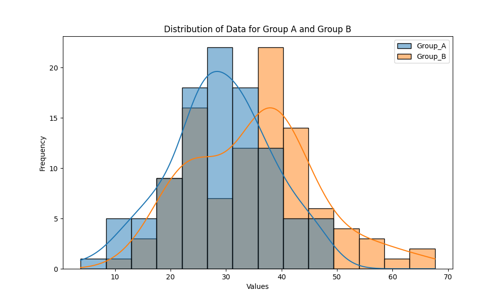
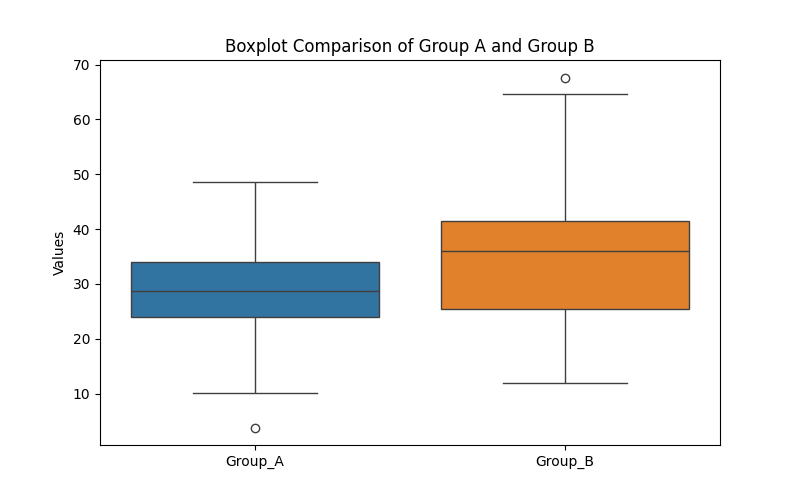

**README.md:**

```markdown
# Data Analysis Script

This Python script performs basic data analysis using synthetic data, leveraging the power of NumPy, Pandas, Matplotlib, Seaborn, and SciPy. It generates synthetic data for two groups, visualizes the distribution, creates a boxplot for group comparison, and performs an independent t-test to determine if there is a significant difference between the groups.

## Prerequisites

Make sure you have Python installed on your machine along with the required libraries. You can install the dependencies using the following command:

```bash
pip install numpy pandas matplotlib seaborn scipy
```

## Usage

1. Clone the repository:

```bash
git clone https://github.com/yourusername/data-analysis-script.git
cd data-analysis-script
```

2. Run the script:

```bash
python data_analysis_script.py
```

3. Check the generated output files in the same directory:

   - `distribution_plot.png`: Image file containing the distribution plot.
   - `boxplot_comparison.png`: Image file containing the boxplot for group comparison.
   - `data_analysis_results.csv`: CSV file containing the results of the data analysis.

## Output Files

### 1. Distribution Plot



This plot illustrates the distribution of data for Group A and Group B.

### 2. Boxplot Comparison



The boxplot provides a visual comparison between the two groups.

### 3. Data Analysis Results

[data_analysis_results.csv](data_analysis_results.csv)

The CSV file contains the results of the data analysis, including the synthetic data and statistical test outcomes.

## Contributing

Feel free to contribute to the project by opening issues or submitting pull requests.

## License

This project is licensed under the [MIT License](LICENSE).
```

Feel free to customize it further to better suit your specific needs!
